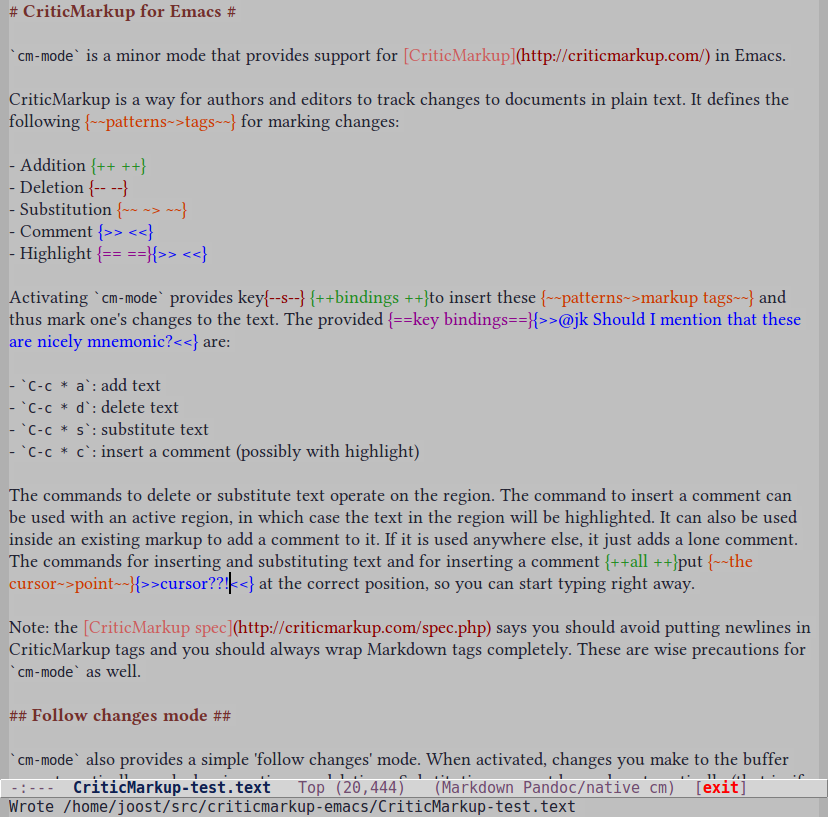

# CriticMarkup for Emacs #

`cm-mode` is a minor mode that provides support for [CriticMarkup](http://criticmarkup.com/) in Emacs.

CriticMarkup is a way for authors and editors to track changes to documents in plain text. It defines the following tags for marking changes:

- Addition {++ ++}
- Deletion {-- --}
- Substitution {~~ ~> ~~}
- Comment {>> <<}
- Highlight {== ==}{>> <<}

Activating `cm-mode` provides key bindings to insert these markup tags and thus mark one's changes to the text. The provided key bindings are:

- `C-c * a`: add text
- `C-c * d`: delete text
- `C-c * s`: substitute text
- `C-c * c`: insert a comment (possibly with highlight)

The commands to delete or substitute text operate on the region. The command to insert a comment can be used with an active region, in which case the text in the region will be highlighted. It can also be used inside an existing markup to add a comment to it. If it is used anywhere else, it just adds a lone comment. The commands for inserting and substituting text and for inserting a comment all put point at the correct position, so you can start typing right away.

The commands for adding and deleting text combine additions/deletions that are adjacent: if you make a new addition next to an existing one, the cursor is simply moved into the addition tag. Similarly, if you delete text adjacent to an existing deletion, the deleted text is moved into the tag.

Note: the [CriticMarkup spec](http://criticmarkup.com/spec.php) says you should avoid putting newlines in CriticMarkup tags and you should always wrap Markdown tags completely. These are wise precautions for `cm-mode` as well.

## Font lock ##

`cm-mode` also adds the markup tags defined by CriticMarkup to `font-lock-keywords` and provides customisable faces to highlight them. The customisation group is called `criticmarkup-faces`. Note that `cm-mode` also makes the markup tags read-only so that you cannot inadvertently modify them.

You may notice that changes that span multiple lines are not highlighted. The reason for this is that multiline font lock in Emacs is not straightforward. There are ways to deal with this, but since `cm-mode` is a minor mode, it could interfere with the major mode's font locking mechanism if it did that. Besides, one is advised not to include newlines inside CriticMarkup tags anyway.

To mitigate this problem, you can use soft wrap (with `visual-line-mode`). Since each paragraph is then essentially a single line, font lock works even across multiple (visual) lines.

## Follow changes mode ##

`cm-mode` also provides a simple 'follow changes' mode. When activated, changes you make to the buffer are automatically marked as insertions or deletions. Substitutions cannot be made automatically (that is, if you mark a word, delete it and then type a replacement, it will still be marked as a sequence of deletion+insertion, not as a substitution), but they can still be made manually with `C-c * s`. You can activate and deactivate follow changes mode with `C-c * F`. When it's active, the modeline indicator for `cm-mode` changes from `CM` to `CM*`. 

Note that some changes are not (properly) recorded. For example, capitalizing, downcasing or upcasing a word with `M-c` / `M-l` / `M-u` leaves a deletion markup but no addition markup. Similar problems may occur with other editing commands.

## Keeping track of the author ##

Comments can be used to keep track of who made a particular change. If you want to do this automatically, you can set the variable `cm-author`. When this variable is set, its value is automatically added as a comment to every change you make, preceded by `@`. If you explicitly make a comment with `C-c * c`, the value of `cm-author` is inserted at the beginning of the comment.

The variable `cm-author` can be set through Customize or with `setq-default` in your init file. This sets the global value. You can override this global value in a particular buffer by setting a buffer-local value. There are two ways to do this: you can use `C-c * t` (for *tag*), which will only set the value for the current session, or you can use a file-local (or directory-local) variable, which makes sure the value is set every time the file is loaded. (Note: if you use [Pandoc](http://johnmacfarlane.net/pandoc/), you can specify file-local variables with html comments, since Pandoc ignores html comments for all output formats.)

If `cm-author` is set, a new addition or deletion that is adjacent to an existing one is not combined with it if it has a different author tag. This way you can add changes to a text that already has changes from another author and still keep track of who did what. This *only* works for changes that have a comment with an author tag, however. If the existing addition/deletion does not have an author tag, any addition/deletion made adjacent to it is simply combined with it.

Note that the modeline shows the buffer's author tag: if `cm-author` is set, the modeline indicator for `cm-mode` takes the form `CM@<tag>`.

## Navigating changes ##

You can jump to the previous/next change with the commands `C-c * b` and `C-c * f`, respectively. If point is inside a change, you can jump out of it with `C-c * *`.

## Accepting or rejecting changes ##

You can interactively accept or reject a change by putting the cursor inside it and hitting `C-c * i`. For additions, deletions and substitutions, you get a choice between `a` to accept the change or `r` to reject it. There are two other choices, `s` to skip this change or `q` to quit, which both leave the change untouched. If you're just dealing with the change at point, they are essentially identical, but they have different functions when accepting or rejecting all changes interactively.

For comments and highlights, the choices are different: `d` to delete the comment or highlight (whereby the latter of course retains the highlighted text, but the comment and the markup are removed), or `s` to skip the comment or highlight. Again `q` quits and is essentially identical to `s`.

You can interactively accept or reject all changes with `C-c * I` (that is a capital `i`). This will go through each change asking you what you want to do with it. Here, `s` skips the current change and moves on to the next one, while typing `q` leaves the current change alone and quits the accept/reject session.

## Disclaimer ##

`cm-mode` should be considered alpha software, so try at your own risk. If you run into problems, I would very much appreciate it if you open an issue on Github or send me an email.

## TODO ##

- Commands to accept or reject all changes in one go. (These won't be bound to keys, though.)
- Automatic generation of time/date stamp in comments.
- Mouse support?

## Sceenshot ##

(Yes, I use a variable-width font in my Markdown buffers.)
